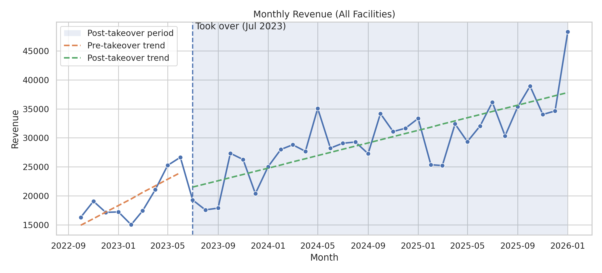
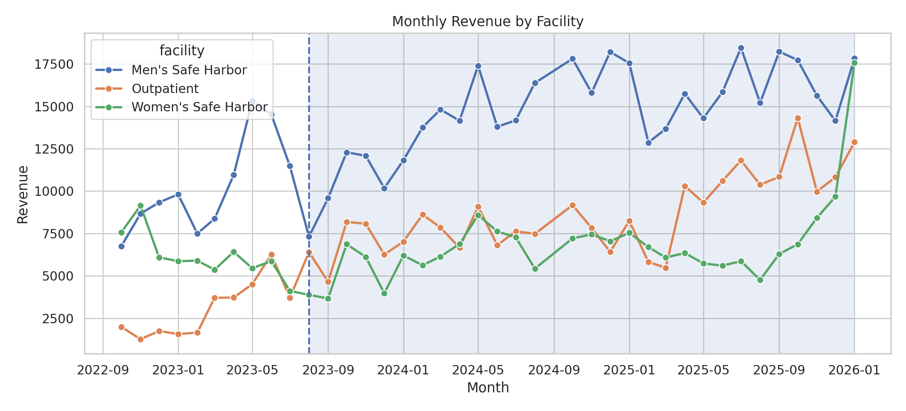

# Multi-Year Revenue Analysis (Oct 2022 - Jan 2026)

This project analyzes multi-year revenue performance across six recovery facilities.  
The objective is to evaluate month-to-month revenue trends, quantify operational growth, and measure program performance before and after assuming coordination responsibilities in August 2023.

The analysis demonstrates applied data modeling, fiscal-year billing logic, facility-level segmentation, and executive-level reporting suitable for data analyst or data science roles.

---

## Business Objective

Given encounter-level service logs across multiple facilities, this project answers:

- How has total revenue evolved month-to-month from Oct 2022 through Jan 2026?
- How does revenue differ by facility (Men’s, Women’s, Outpatient)?
- Did revenue performance change after August 2023?
- What is the quantified pre vs post operational impact?

The ultimate goal is to measure sustained revenue growth and operational performance over time.

---

## Dataset

- Time Range: October 2022 - January 2026  
- Scope: Individually provided services only (group encounters excluded)  
- Facilities: Six recovery houses (aggregated by Encounter Facility)  
- Unit of Analysis: Encounter-level records  

Key fields:

- `encounter_date`
- `cpt_code`
- `duration_min`
- `encounter_facility`
- `fiscal_year`
- `revenue` (computed)

Note: The GitHub repository uses masked/synthetic data. No real client information is included.

---

## Billing Logic

Revenue is calculated using fiscal-year specific billing rates.

### Per-Encounter Codes
- 90832
- 90834
- 90837
- H0001
- H0006
- T1012
- T1007

### Time-Based Codes (15-minute units)
- H0038
- H0004

Units for time-based services are calculated as:

```
units = floor(duration_min / 15)
```

Fiscal-year rate tables are applied as follows:

- FY23 rates  
- FY24 rates  
- FY25 rates  

Example (T1007):
- FY23: $117 per encounter  
- FY24 & FY25: $129 per encounter  

This ensures revenue calculations align with real billing structure changes over time.

---

## Methodology

1. Clean and normalize encounter-level data
2. Apply fiscal-year rate tables
3. Compute encounter-level revenue
4. Aggregate to monthly rollups:
   - Total revenue
   - Revenue by facility
5. Perform pre vs post (Aug 1, 2023) comparison
6. Visualize trends with seaborn
7. Add post-takeover trendline (linear regression)

---

## Results

### 1. Monthly Revenue (All Facilities)



Key Observations:

- Revenue demonstrates sustained growth following August 2023.
- Post-takeover average monthly revenue increased significantly.
- Linear regression trendline during post period confirms consistent upward trajectory.
- Growth is sustained over multiple fiscal years, not a short-term spike.

Pre vs Post Comparison (automatically calculated in analysis):

- Average Monthly Revenue (Pre-Aug 2023): ~$19,461  
- Average Monthly Revenue (Post-Aug 2023): ~$30,011  
- Change: +54.2%

This suggests substantial operational impact and sustained program growth.

---

### 2. Revenue by Facility



Key Observations:

- Growth trends are visible across multiple facility categories.
- Revenue distribution indicates stable performance across sites.
- No single facility drives the entire increase, suggesting coordinated operational improvements.

---

## Analytical Techniques Used

- Fiscal-year conditional revenue modeling
- Time-based billing unit conversion
- Month-to-month aggregation
- Facility-level segmentation
- Linear regression trend analysis (pre vs post)
- Seaborn-based visualization
- Executive-level performance summarization

---

## Repository Structure

```
multi-year-revenue-analysis/
│
├── README.md
├── requirements.txt
├── .gitignore
│
├── data/
│   └── sample_revenue_Oct22-Jan26.csv
│
├── notebooks/
│   ├── 01_revenue_modeling.ipynb
│   ├── 02_rollups.ipynb
│   └── 03_trends_and_visuals.ipynb
│
├── src/
│   ├── revenue_model.py
│   └── viz.py
│
├── outputs/
│   ├── monthly_revenue_total.png
│   └── monthly_revenue_by_facility.png
```

---

## Skills Demonstrated

- Revenue modeling with fiscal-year rate logic
- Time-based billing unit calculations
- Multi-year time series aggregation
- Segmented analysis by operational category
- Trendline modeling (linear regression)
- Executive summary communication
- Translating operational logs into business KPIs

---

## Role Alignment

This project reflects responsibilities aligned with:

- Data Analyst
- Business Intelligence Analyst
- Operations Analyst
- Revenue Analyst
- Healthcare Analytics
- Applied Data Science (business-focused)

It demonstrates the ability to:

- Work with multi-year structured datasets
- Apply domain-specific logic to financial modeling
- Quantify operational impact
- Communicate findings visually and clearly

---

## Disclaimer

This repository uses synthetic or masked data for demonstration purposes.  
All billing rates, facilities, and values are included strictly for portfolio demonstration.